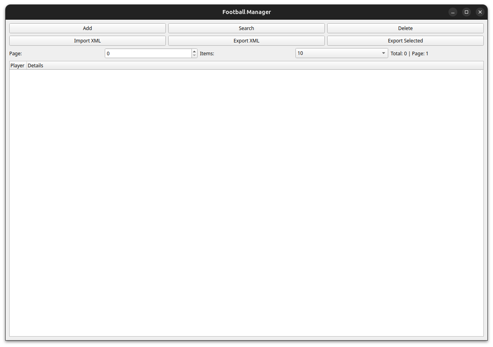

# ⚽ Football Manager App

A desktop application for managing football player data with GUI (PyQt5), XML import/export, and SQLite database support.

[](https://www.python.org/)



## ✨ Features

- **CRUD Operations**  
  Create, Read, Update, Delete player records
- **Advanced Search**  
  Multi-criteria player search
- **Data Import/Export**  
  XML support with schema validation
- **Pagination**  
  Configurable view (10/25/50 items per page)
- **Data Validation**  
  Enforce mandatory fields and valid dates
- **Error Handling**  
  Custom exceptions with user-friendly messages

## 🛠️ Technologies

- **Frontend**: PyQt5
- **Backend**: Python 3.12
- **Database**: SQLite
- **Testing**: Pytest + pytest-qt
- **Build**: pip + virtualenv

## 📦 Installation

### Prerequisites
- Python 3.12+
- pip 23.0+

```bash
# Clone repository
git clone https://github.com/IRomanchuk06/football_app.git
cd football-manager

# Create and activate virtual environment
python -m venv .venv
source .venv/bin/activate  # Linux/MacOS
# .venv\Scripts\activate  # Windows

# Install dependencies
pip install -r requirements.txt
```

## 🚀 Usage

```bash
# Run application
python -m src/app.py

# Run tests
pytest tests/ -v --cov=src --cov-report=html
```

### Key Functionality
1. **Add Player**  
   Full validation of input fields
2. **Search Players**  
   Combine multiple search criteria
3. **Remove Players**
   Deleting a player by multiple criteria
5. **Bulk Operations**  
   Delete/Export groups of players
6. **Data Persistence**  
   Automatic SQLite database creation
7. **XML Integration**  
   Full round-trip data conversion

## 🗄️ Project Structure

```
football-manager/
├── src/
│   ├── controllers/         # Business logic
│   ├── models/              # Data models
│   ├── repositories/        # Database operations
│   ├── services/            # XML handling
│   ├── views/               # GUI components
│   ├── exceptions/          # Custom exceptions
│   └── app.py               # Entry point
├── tests/                   # Unit+integration tests
├── screenshots/             # Screenshots for README.md
├── data/                    # XML players examples
└── requirements.txt         # Dependency list
```

## 🧠 Data Model

```python
class Player:
    def __init__(
        self,
        full_name: str,
        birth_date: date,
        team: str,
        home_city: str,
        squad: str,
        position: str
    ):
        self.full_name = full_name
        self.birth_date = birth_date  # datetime.date
        self.team = team
        self.home_city = home_city
        self.squad = squad
        self.position = position
```

## 📁 XML Schema

```xml
<!-- players_example.xml -->
<players>
  <player>
    <full_name>Lionel Messi</full_name>
    <birth_date>1987-06-24</birth_date>
    <team>Inter Miami</team>
    <home_city>Miami</home_city>
    <squad>Main</squad>
    <position>Forward</position>
  </player>
</players>
```

## 🧪 Testing

### Test Coverage
```
Name                                      Stmts   Miss  Cover  
-------------------------------------------------------------
src/__init__.py                               0      0   100%
src/controllers/__init__.py                   0      0   100%
src/controllers/player_controller.py        135     11    92% 
src/exceptions/__init__.py                    0      0   100%
src/exceptions/exceptions.py                  4      0   100%
src/models/__init__.py                        0      0   100%
src/models/player.py                         17      0   100%
src/repositories/__init__.py                  0      0   100%
src/repositories/database_repository.py     122      0   100%
src/services/__init__.py                      0      0   100%
src/services/xml_handler.py                  43      0   100%
src/views/__init__.py                         0      0   100%
--------------------------------------------------------------
TOTAL                                       321     11    97%
```